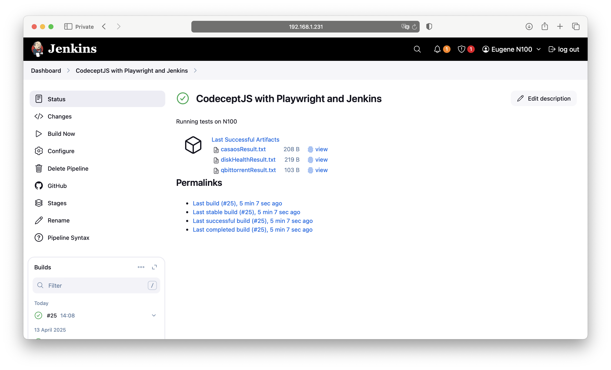
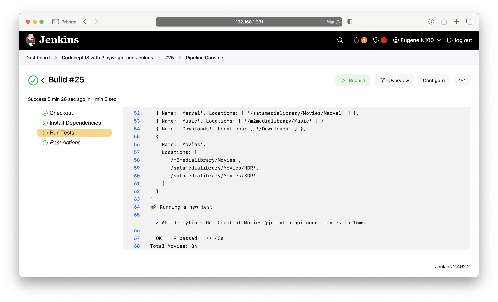

# 🤖 CodeceptJS + Playwright E2E Tests of a HomeLab

This project uses [CodeceptJS](https://codecept.io/) with [Playwright](https://playwright.dev/) for automated end-to-end testing of a local HomeLab on Ubuntu, running [CasaOS](https://www.casaos.io/) as the container management interface. [Jellyfin](https://jellyfin.org/), [qBittorrent](https://www.qbittorrent.org/), and [Scrutiny](https://github.com/AnalogJ/scrutiny) run as Docker containers orchestrated via CasaOS. A sample [Jenkins](https://www.jenkins.io/) pipeline configuration is also included for continuous test execution and artifact reporting.

[Watch more about the Homelab on my YouTube channel](https://youtu.be/M56FPEAKSi0)

---

## 🧪 Tested Scenarios

### 🔍 UI Scenarios

- ✅ Get downloading list in **qBittorrent**
- ✅ Get disk health report using **Scrutiny**
- ✅ Get CPU and RAM usage in **CasaOS**
- ✅ Get temperature info in **CasaOS**
- ✅ Get storage info in **CasaOS**
- ✅ Refresh movie library in **Jellyfin**
- ✅ Refresh series library in **Jellyfin**

### 🔌 API Scenarios

- ✅ Get list of libraries from **Jellyfin**
- ✅ Get count of movies from **Jellyfin**

---

## 📦 Prerequisites

- Node.js (v16+ recommended)
- npm

---

## 🚀 Installation

```bash
npm install
```

## 🚀 Usage
```bash
# Run all tests
npx codeceptjs run

# Run all tests with steps output
npx codeceptjs run --steps

# Run all tests in headless mode with steps
HEADLESS=true npx codeceptjs run --steps

# Run tests with a specific tag
npx codeceptjs run --grep @getTemperature

# Rebuild type definitions
npx codeceptjs run def

# Run tests and generate a mochawesome report
npx codeceptjs run --reporter mochawesome
```

## 🚀 Git
```bash

# List all the remote repositories associated with your local Git repository
git remote -v

# Update the URL of the remote repository named origin
git remote set-url origin https://github.com/eugeneburdukov/codeceptjs-playwright-homelab.git

# Create a new branch
git checkout -b exampleBranch      

# Stage changes
git add .   

# Check status
git status        

# Commit changes
git commit -m "added features"

# Push to remote
git push origin exampleBranch    
```

## 📸 Screenshots

You can find screenshots of the test results in the repository folder:  
`codecept-playwright-homelab-e2e/githubScreenshots/`

Here is a preview:




## 🚀 Output example:
```bash

+ HEADLESS=true npx codeceptjs run
creating output directory: /var/jenkins_home/workspace/CodeceptJS with Playwright and Jenkins/output
CodeceptJS v3.7.3 #StandWithUkraine
Using test root "/var/jenkins_home/workspace/CodeceptJS with Playwright and Jenkins"

HomeLab report --
🚀 Running a new test
File Name - Progress - State
debian-12.10.0-amd64-netinst.iso - 62.872729067930486% - 📥 Downloading

  ✔ get Downloading list @qbittorrent in 5472ms
🚀 Running a new test
[
  '/DEV/SDA - SAT - CT4000BX500SSD1, Temperature: 37°C, Capacity: 3.6 TiB, Powered on: 32 days, Status: Passed',
  '/DEV/NVME0 - NVME - CT2000P3PSSD8, Temperature: 44°C, Capacity: 1.8 TiB, Powered on: 71 days, Status: Passed'
]

  ✔ get Disk health report @getDiskHealth in 2551ms
🚀 Running a new test
CPU: 52%, RAM: 27%

  ✔ get CPU and RAM Info @getPcInfo in 1023ms
🚀 Running a new test
Temperature is  3.0W / 61°C 

  ✔ get Temperature Info @getTemperature in 1145ms
🚀 Running a new test
Storage:
nvme0n1p3 | Available: 214.94 GB (Total: 273.28 GB)
nvme0n1p1 | Available: 201.01 GB (Total: 1.52 TB)
sda1 | Available: 270.55 GB (Total: 3.58 TB)


  ✔ get Storage Info @getStorage in 2049ms
🚀 Running a new test

  ✔ Refresh Movie Library @JupdateMovieLibrary in 6464ms
🚀 Running a new test

  ✔ Refresh Series Library @JupdateSeriesLibrary in 5840ms
🚀 Running a new test

  ✔ API Jellyfin - Get List of Libraries @jellyfin_api_getListOfLibraries in 12ms
[
  {
    Name: 'DC',
    Locations: [ '/m2medialibrary/DC', '/satamedialibrary/Movies/DC' ]
  },
  {
    Name: 'Collections',
    Locations: [ '/config/data/data/collections' ]
  },
  {
    Name: 'Christmas Time',
    Locations: [ '/satamedialibrary/Movies/ChristmasTime' ]
  },
  {
    Name: 'Shows',
    Locations: [ '/m2medialibrary/Shows', '/satamedialibrary/Shows' ]
  },
  { Name: 'Marvel', Locations: [ '/satamedialibrary/Movies/Marvel' ] },
  { Name: 'Music', Locations: [ '/m2medialibrary/Music' ] },
  { Name: 'Downloads', Locations: [ '/Downloads' ] },
  {
    Name: 'Movies',
    Locations: [
      '/m2medialibrary/Movies',
      '/satamedialibrary/Movies/HDR',
      '/satamedialibrary/Movies/SDR'
    ]
  }
]
🚀 Running a new test

  ✔ API Jellyfin - Get Count of Movies @jellyfin_api_count_movies in 15ms

  OK  | 9 passed   // 43s
Total Movies: 84 
```
